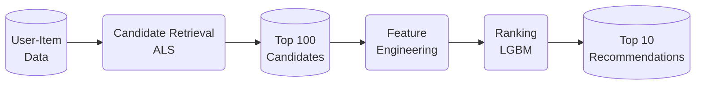
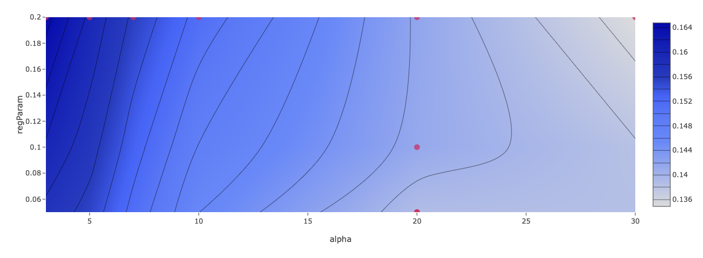

# Two-Stage Recommender System 
This project builds a production-style recommender system using retrieval and ranking architecture.

The system retrieves candidates using ALS collaborative filtering and then ranks them via LightGBM. Experiments are tracked via MLflow.

Using the MovieLens 20M dataset, the goal is to build an offline recommender to create an optimised ranked list per user.

## System Architecture

The architecture is broken up into two stages:
1. **Retrieval Stage** Using ALS and the ratings data to generate 100 recommendations per user.
2. **Ranking Stage** After feature engineering and by incorporating genome scores (i.e. item feature vectors), LGBM is used to finalise 10 recommendations per candidate.

### Dataset
MovieLens20M
Source: https://www.kaggle.com/datasets/grouplens/movielens-20m-dataset

Contains:
- Timestamped user ratings 
- Movie genre features and scores

## Retrieval
Candidate generation is performed using Alternating Least Squares (ALS) and run over spark.

Evaluation Metrics:
- Normalised Discounted Cumulative Gain (NDCG)
- Mean Average Precision (MAP)
- Ranking @ K
- Precision @ K

### Experiment Tracking
Experiments are tracked via ML Flow.

Significant hyperparameters: 
- Rank
- Alpha
- Max Iterations
- Regularisation Parameter

### Experiment Results
Decreases in **alpha** and increases in **regParam** increased the **NDCG** score.

Final parameters were:
- alpha: 3
- rank: 50
- regParam: 0.2
- maxIter: 10

## Future Improvements
Given the avilability of content-based filtering data, some future avenues for improvement are:
- Hybrid-model for retrieval (Two-Tower)
- Deep Neural Network (DNN) for ranking stage
- Comparison of other techniques, e.g. ANN
- Reranking (e.g. Diversity, Coverage, Serendipity)
